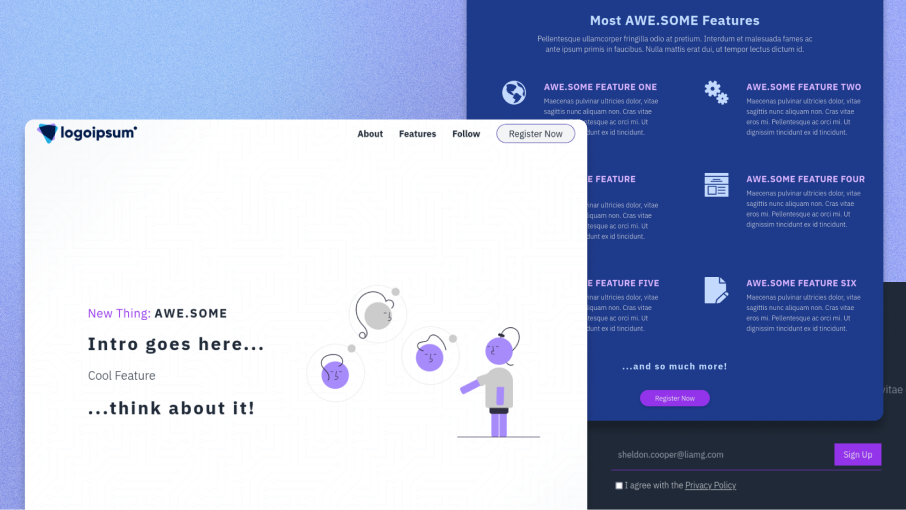

# astro-landing-page

A simple landing page built with Astro and Tailwind CSS.

[](https://awesomestro.ttntm.me)

> Port of the [11ty](https://github.com/ttntm/11ty-landing-page) & [Hugo](https://github.com/ttntm/hugo-landing-page) versions

## How to use this template

**Requirements:**

1. Astro (developed and tested with version 2.10.12)
2. Tailwind CSS (Astro integration)

All other dependencies are either linked from a CDN or included in this repository.

**Setup:**

1. Fork, clone or download
2. `cd` into the root folder
3. run `npm install`
4. run `npm run dev`
5. open a browser and go to `http://localhost:4321`

**Setup Alternative:**

`npm create astro@latest -- --template ttntm/astro-landing-page`

See: [Starter Templates](https://docs.astro.build/en/install/auto/#starter-templates) in the official docs.

**Basic configuration:**

1. Astro -> `./astro.config.mjs`
2. Tailwind -> `./tailwind.config.cjs`
3. Netlify -> `./netlify.toml`

CSS (in `./src/styles/`) is processed by Astro directly; this project is using the [Tailwind integration module](https://docs.astro.build/en/guides/integrations-guide/tailwind/).

**Deployment:**

Astro requires the final deployed URL in its config file.

Replace the placeholder with your site's URL and keep the trailing slash:

```js
case 'production':
  build.siteURL = 'https://example.com/'
  break
```

**Change Content:**

Page content is stored in

- `./src/pages/`
  - `imprint.md`
  - `privacy.md`
- `./src/content/sections/`
- `./src/data/features.json`

# PT Centella Global Corp — Website (Astro)

This repository now contains an Astro-based company landing site for PT Centella Global Corp.

Quick start (local):

```bash
npm ci
npm run dev
```

Open http://localhost:4321 to preview.

Build for production:

```bash
npm run build
```

The build output will be in `./dist/` and the included GitHub Actions workflow will deploy `./dist/` to the `gh-pages` branch.

Notes:
- Move the existing logo into `public/centella.jpeg` (or update paths) so Astro serves the image at `/centella.jpeg`. Currently the site references `/assets/files/centella.jpeg` — you can keep it there but ensure the path is valid for the final build.
- If you want to remove the old Jekyll files, they are archived in `jekyll-archive/`.

Contact & business info are in `src/content/sections/register.md` and site metadata is in `src/data/site.json`.

Deployment on GitHub Pages: the workflow `.github/workflows/deploy.yml` builds and deploys to the `gh-pages` branch when pushing to `main`.

If you want I can run `npm ci` and `npm run build` now to verify the build artifacts.
